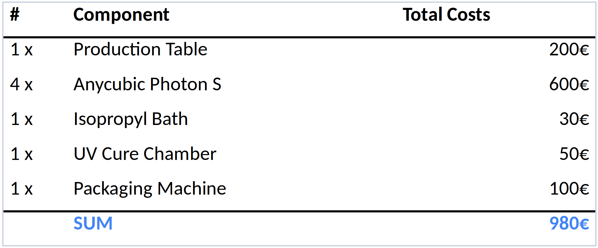
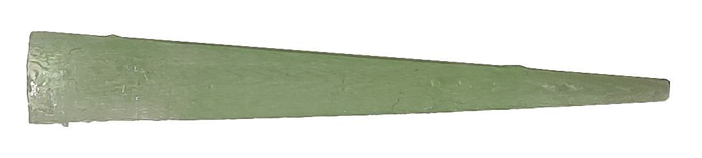
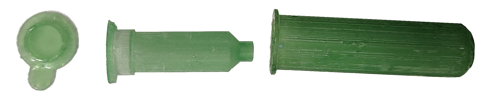
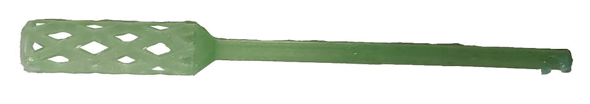
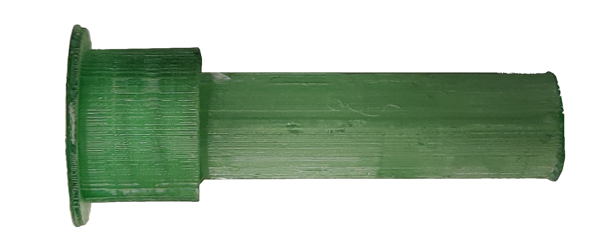

# TUMuchIdeas
This is the technical project description of the [TUM techchallenge](http://techchallenge.de/) to target the shortage of plastic consumables for COVID-19 PCR tests.

## About us

We are a team of 4 highly motivated students and have known each other for over 3 years. We have diverse backgrounds in technology (electrical/mechanical engineering & computer science) and management (TUM-BWL). We joint our forces to help to overcome the shortages of plastic consumables for PCR tests in Ghana.

## Brief Introduction and our Solution Approach

The coronavirus pandemic is an ongoing pandemic caused by the COVID-19 disease (for more information to the pandemic we refer to [wikipedia](https://en.wikipedia.org/wiki/COVID-19_pandemic)).
In order to control this pandemic by disrupting infection chains, PCR tests have been one of the most essential tools so far.
Extensive PCR testing by many countries has lead to shortages and price increases for testing equipment.
Since first world countries have a higher market power and more money to spend compared to third world countries, this development has hit third world countries disproportional more than first world countries.
In particular, third world countries are struggling to get  access to plastic consumables for PCR tests on the world market. These are swabs, tubes, pipette tips, and spin columns.

To dampen the effects of supply shortages of such consumables, we have developed a mobile production table which is capable of producing these consumables within the testing laboratories. Our production plant is optimized to be simply deployable to laboratories in third world countries, to be operable by a low amount of labor, and only requires a minimum amount of training to be operated.

## Materials and Methods

Our production setup consist of 4 steps: 3D printing, isopropyl bath, UV cure, and Packaging.
Short descriptions of every steps are found in the figure below.

The table we provide consists of 4 3D printers from the company Anycubic, one isopropyl bath,
and an UV chamber.
The costs for one table are shown in the figure below.

The total cost of one such table is about 1000€.

### Printing

As a printer, we use the [Photon S from Anycubic](https://www.anycubic.com/products/anycubic-photon-s).

To print the plastic consumables, first the CAD files are needed. These are found
[here](data/CAD_models).
The CAD model of the consumables have to fit perfectly to the laboratory equipment.
Since some laboratories use slightly different equipment, eventually some of the models
have to be adapted if other laboratories want to use them too.
Once the model is adapted, it has to be sliced and converted to a file which is compatible with the 3D printer.
For the printer we use, this is a ".pw0" file.
A detailed description of how to slice the files is found [here](https://github.com/ANYCUBIC-3D/PhotonWorkshop#how-to-use-photon-workshop).
Afterwards, the printing can be started.

For the printing we use the [surgical guide resin](https://dental.formlabs.com/de/shop/materials/surgical-guide-resin/) from Formlabs for the swabs and
the [Anycubic transparent 3D printer resin](https://www.anycubic.com/collections/uv-resin/products/colored-uv-resin-for-photon-series?variant=34622234362018) from Anycubic for the other parts.

### Isopropyl Bath

Post processing consists of two parts: Rinsing of excess material and UV curing.
For rinsing the excess resin we put the printed model into an isopropyl bath.

TODO: Wie lange muss das Teil drinnen bleiben?

### UV chamber

For UV curing we build a custom designed UV chamber. It consists of a trash can out of metal,
where we put a cord with 2 UV lamps through the lid. Both UV lamps are 405 nm lamps.
The model than put on a glass plate which is then put into the UV chamber.

TODO: Wie lange dauert der Prozess?

### Packaging

Since our production happens within the laboratory, for consumables which are used within
a small amount of time, packaging is not required. However, this requires a good logistics
by the operators of the laboratory.
For equipment which should be stored, or should be delivered to other places (which is necessary for the swabs),
the consumables can be packaged into sterilized pouches.
A cheaper solution would be to use a plastic sealing machine.

## Results

In the following pictures of some of our printed consumables are shown.

| Name | Image |
|-----------------|---------------------------------|
| pipette |  |
| spin column |  |
| swab |  |
| tube (1.5 ml) |  |
| tube (0.2 ml) |  |

In the following, we analyze the cost of our printed consumables and compare these to market prices. The market prices where given by [Bio.Kitchen](https://www.utum-bio-kitchen.de/). The complete calculation sheet can be found [here](data/TC_Calculation.xlsx). None of the calculation includes labor costs.

From this figure, it can be seen that our production prices are lower for swabs and 0.2 ml tubes, but higher for the other parts. However, we expect that ordering resin in larg amounts can further reduce the prices of our solution.

The next figure shows the amount of single consumables which can be produced with one of our tables in one day.

The red line indicated the amount of consumables needed for a single day. That means, our solution is not able to completely replace all kind of consumables without any lead time. However, we assume that shortages are known in advance and only last for a couple of days. If this is the case, our solution is able to bridge these shortages.

The next figure shows the money which can be saved per day and printer by producing consumables while there is no shortage.

The most money can be saved if swabs are produced. However, since we can print more swabs than needed per day, merely printing swabs is not the way to go.

## Discussion and Outlook

Due to the pandemic we had limited access to the laboratory at the university. Therefore we could not test if the production of the printed parts can be realized without RNA contamination. Additionally we had to print our swabs with a different resin, since it was impossible to obtain the surgical guide resin from Formlabs, without exceeding the limit on our budget.

Nevertheless we were able to print all required plastic consumables for a PCR test. Parts such as the 0.2 ml Tubes or Swabs can even compete with global market prices.
