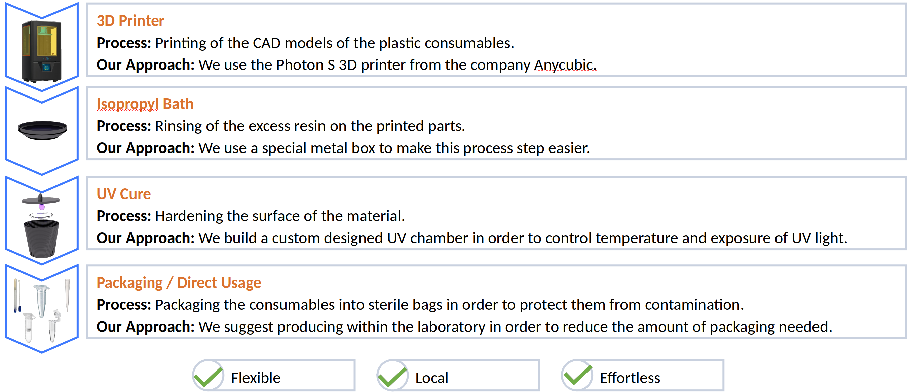

# TUMuchIdeas
Technical Project Description of the TUM techchallenge to target the shortage of plastic consumables for COVID-19 PCR tests.

## About us

## Brief Introduction and our Solution Approach

The coronavirus pandemic is an ongoing pandemic caused by the COVID-19 disease (for more information to the pandemic we refer to [wikipedia](https://en.wikipedia.org/wiki/COVID-19_pandemic)).
In order to control this pandemic by disrupting infection chains, PCR tests have been one of the most essential tools so far.
Extensive PCR testing by many countries has lead to shortages and price increases for testing equipment.
Since first world countries have a higher market power and more money to spend compared to third world countries, this development has hit third world countries overproportional more than first world countries.
In particular, third world countries are struggling to get  access to plastic consumables for PCR tests on the world market. These are swabs, tubes, pipette tips, and spin columns.

To dampen the effects of supply shortages of such consumables, we have developed a mobile production table which is capable of producing these consumables within the testing laboratories. Our production plant is optimized to be simply deployable to laboratories in third world countries, to be operable by a low amount of labor, and only requires a minimum amount of training to be operated.

## Materials and Methods

Our production consists of three steps: printing, post processing, and packaging.

### Printing

To print the plastic consumables, first the CAD files are needed. These are found
here (TODO).
The CAD model of the consumables have to perfectly fit to the laboratory equipment.
Since every laboratory uses slightly different equipment, eventually some of the models
have to be adapted.
If the model is finished, it has to be sliced and converted to a STEP file for the 3D printer.
Afterwards, the printing can be started.

For the printing we use the .... resin.

### Post Processing

Post processing consists of two parts: Rinsing of excess material and UV curing.
For rinsing the excess resin we put the printed model into an isopropanol bath.

TODO: Wie lange muss das Teil drinnen bleiben?

For UV curing we build a custom designed UV chamber. It consists of a trash can out of metal,
where we put a cord with 2 UV lamps through the lid. Both UV lamps are 405 nm lamps.
The model than put on a glass plate which is then put into the UV chamber.

TODO: Wie lange dauert der Prozess?

### Packaging

Since our production happens within the laboratory, for consumables which are used within
a small amount of time, packaging is not required. However, this requires a good logistics
by the operators of the laboratory.
For equipment which should be stored, or should be delivered to other places (which is necessary for the swabs),
the consumables can be packaged into sterilized pouches.

## Results

In the following pictures of some of our printed consumables are shown.

| Name | Image |
|-----------------|---------------------------------|
| pipette |  |
| spin column |  |
| swab |  |
| tube |  |

In the following, we analyze the cost of our printed consumables and compare these to market prices. The market prices where given by [Bio.Kitchen](https://www.utum-bio-kitchen.de/). The complete calculation sheet can be found [here](data/TC_Calculation.xlsx). None of the calculation includes labor costs.

From this figure, it can be seen that our production prices are lower for swabs and 0.2 ml tubes, but higher for the other parts. However, we expect that ordering resin in larg amounts can further reduce the prices of our solution.

The next figure shows the amount of single consumables which can be produced with one of our tables in one day.

The red line indicated the amount of consumables needed for a single day. That means, our solution is not able to completely replace all kind of consumables without any lead time. However, we assume that shortages are known in advance and only last for a couple of days. If this is the case, our solution is able to bridge these shortages.

The next figure shows the money which can be saved per day and printer by producing consumables while there is no shortage.

The most money can be saved if swabs are produced. However, since we can print more swabs than needed per day, merely printing swabs is not the way to go.

## Discussion and Outlook
